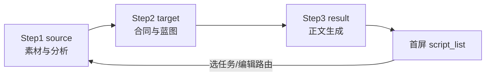
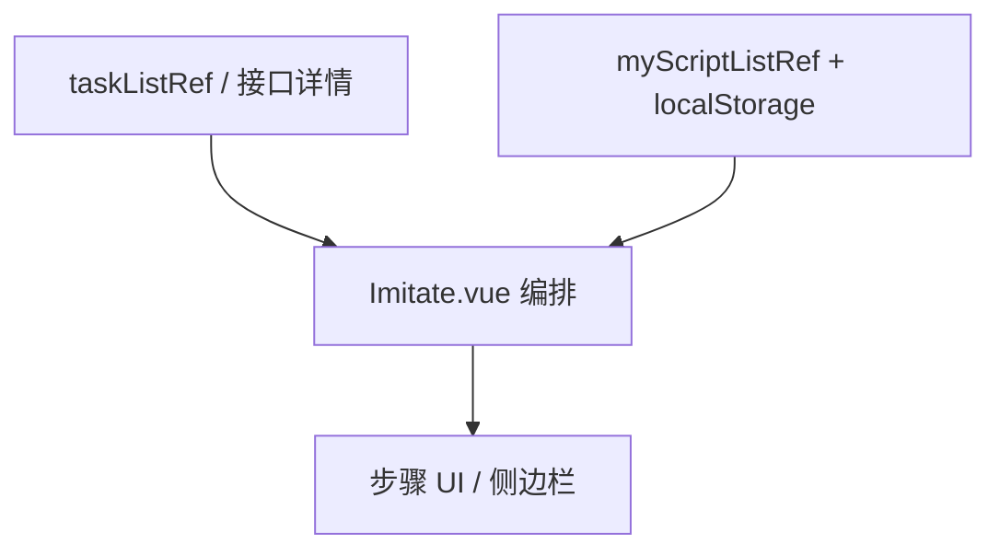

前言
- 在AI coding时，我们常有这样的困扰：
  - 语法对但逻辑错：边界、空值、并发、时区等易遗漏
  - 模型不了解项目架构、规范、历史逻辑，重复造轮子或风格不一致
  - Prompt 模糊时结果偏差大
  - API/依赖/语法可能过时，版本混用
  - TypeScript 滥用 any，类型不严谨
  - 过度设计：不必要的抽象、依赖、模式
  - 测试不足：缺少边界、异常、错误场景
  - 代码漏洞：SQL 注入、XSS、权限绕过、明文密码等
  - 隐私风险：误传密钥、私有代码、用户数据
  - token爆炸：对话一长，token像滚雪球一样越来越大
  本文即聚焦：如何既高效保证代码产出质量，又降低 Token 消耗。
为什么会出现上述问题？
- AI 的核心机制是“模式预测”，不是严格推理，所以容易产出看起来像对的代码
- 训练数据滞后：学到的是历史代码，不等于最新官方文档
- 上下文不完整：不知道架构、规范、业务隐含规则
- 需求描述不完整：信息不足时可能给出一个“通用但不适配”的方案
- 不知道隐含业务规则
- 缺少长期维护视角：通常关注“当前这个问题怎么解决”，弱于扩展性、可测试性、可观测性
Token 浪费的典型场景
- Token 成本到底花在哪里？
  总token = 未缓存输入token + 缓存写入token + 缓存读取token + 输出token
类型
含义
典型单价
输入token
未命中缓存的上下文 
基准价
缓存写入token
首次把某段前缀写入 Key-Value 缓存
通常有溢价
缓存读取token
与上一轮前缀逐字节匹配的重用部分
显著低于输入token单价
输出token
模型输出内容
通常高于输入，且无法缓存
  - （以cursor为例）输入 Token 有 System Prompt、历史对话记录、工具调用的元数据与参数、全局rules、选中的文件/图片/代码上下文、子代理定义以及用户当前的问题。  
[Image]
  - 输出 Token 有 模型的最终回答、生成的 Markdown/JSON 结构化文本、代码输出、工具调用的解释以及推理模型的长文本思维链。
一次看似简单的 AI coding 任务，底层 的 Agent 通常会经历“搜索、读文件、修改代码、运行测试、捕获报错、再次修复、最终复查”的过程。在这个多轮迭代中，每一轮对话都会把前几轮所有的代码片段、终端日志作为历史上下文重新发送给模型。这意味着，轮次越多，token 消耗越快。
- 场景：
  - 全量扫描与冗余输入：在未缩小范围的情况下进行整仓扫描，或盲目选中包含大量无关信息的整段长日志。
  - 任务边界模糊：由于问题定义不清，导致 Agent 迷失方向，盲目探索与任务无关的目录及文件。
  - 上下文重复堆砌：在多轮对话中反复输入已有的项目背景、产品需求或开发约束，缺乏有效的上下文管理。
  - 全量输出而非增量更新：要求 AI 输出包含大量重复代码的完整文件，而非仅针对修改点输出精准的差异。
  - 多轮会话累计：未及时清理或重置超长会话，导致大量陈旧信息占据 Context Window，增加处理开销。
  - Prompt Cache 滥用：将频繁变化的动态内容置于常驻规则中，导致 Prompt Cache 无法生效或频繁失效。
AI 时代要做到“角色转变”。很多新手开发者习惯于“一把梭”把整个报错和几千行代码丢给 AI，留下一句“帮我看看怎么回事”。这种做法是将思考的责任完全推卸给模型，导致 AI 盲目猜测，从而带来极高的话题跑偏率和 Token 浪费。 
正确的研发心法是： 开发者要从“机械敲键盘的码农”转变为“给 AI 派活的架构师”。先肉眼定位大致的错误范围和调用链路，再将精准的、高信号的文件上下文喂给 AI。人工花在明确边界、切割问题上的时间越多，后续省下来的 Token 和返工排错的时间就越多。
方法
1. 完整的开发SOP

需求澄清 → 方案设计 → 增量实现 → 验证交付
每一步中人是最主要角色，方案人来拍板，代码人能看懂，AI 只负责分段执行。

推荐skill：superpowers
- 地址：https://github.com/obra/superpowershttps://github.com/obra/superpowers
- 介绍
  把 Agent 从「会写代码的助手」变成「按工程流程工作的团队成员」。它会先帮你 澄清需求、形成设计、拆计划、开隔离分支、按 TDD 写代码、用子 Agent 做任务、每个任务后做 code review，最后再让你选择合并、PR、保留或丢弃分支。
  
- 安装
npx skills add https://github.com/obra/superpowers
# 安装superpower全套skills
[Image]
安装哪些skill（点击a一键全选）
[Image]
安装到哪些agent（有些agent 的skills目录不是.agents/skills，如需在Claude中安装需要先自行建立.claude文件夹）
[Image]
项目级还是全局
[Image]
软连接还是各下一份

- 使用
在对话框中输入“/”，即可查看已安装的skill，选中并跟上自己的需求即可：
[Image]

1. 不急着写代码，先 brainstorm：可以贴UI图、prd等，通过对话理清需求，把想法变成可执行设计。
2. 形成设计文档：brainstorming skill 先查看项目上下文，再逐个提问，提出 2–3 个方案并说明取舍，把设计保存成 docs/superpowers/specs/...-design.md。
3. 写详细实施计划：writing-plans skill 把已批准的设计拆成小任务，每个任务包含要改哪些文件、怎么改、怎么测试、怎么验证，强调 DRY、YAGNI、TDD、频繁提交。
4. 隔离开发环境：using-git-worktrees 在设计通过后用 git worktree 创建独立 workspace 并验证测试基线，避免 Agent 污染主分支，也方便多任务并行推进。
5. 子 Agent 执行任务：subagent-driven-development 给每个任务派一个新的 implementer subagent，再派 reviewer subagent 做规格符合性和代码质量检查，减少上下文污染，让每个 Agent 专注当前任务。
6. TDD 强约束：先写失败测试，再写最小实现，再重构；没有失败测试之前，不写生产代码。
7. 代码审查和收尾：requesting-code-review skill 在完成任务、重大功能、合并前触发代码审查，Critical 和 Important 问题需要先修复，不能跳过。

- 选择
不是所有的场景都适合，简单场景流程反而过重：
适合
价值
新功能开发
先设计、再计划、再 TDD 实现
老项目重构
防止 Agent 大范围乱改
Bug 排查
强制根因分析，减少猜测式修复
多人团队协作
统一 AI 开发规范
产品需求落地
把模糊需求转成规格和任务
自动化测试补齐
通过 TDD 和 review 提升覆盖
研发流程沉淀
把团队经验写成 skills
不适合
原因
一次性 demo
流程可能偏重
只想让 AI 快速改一行
Superpowers 会倾向先确认流程

- 收益：把 AI 编程从 prompt-driven 变成 process-driven。
  - 对研发团队：需求落地更稳定、代码质量更可控、返工成本更低；git worktree 隔离让多人协作更安全；团队规范可沉淀成 skills，新人和 Agent 都能照做。
  - 对产品/运营/增长团队：帮产品把粗糙想法整理成可执行规格；帮运营把活动需求转成技术方案；帮增长团队规范实验设计。
  
2. 飞书mcp

详情及安装链接：https://github.com/larksuite/lark-openapi-mcp
- 本质：让AI读文档帮你干活
- case：
[Image]
[Image]
3. 选择合适的模型和模式

模型
- 小模型：简单需求、脚本、局部解释、日志摘要。
- 强模型：跨模块重构、修复复杂 bug、设计架构方案、做风险评审。
- 混合策略：让便宜模型做搜索和摘要，让强模型做最终判断和关键修改。
应该对模型能力有个基本的了解，心中有数才能在使用时恰当选择模型，既省心又省钱。

比如说很多人对auto模型嗤之以鼻，认为这个模型根本干不了活，总出错，实际上auto 是一个 模型路由器 / 自动模型选择器：Cursor 根据任务，在一组可用模型里自动挑一个。它的目标是在 能力、成本、速度、稳定性、当前可用性 之间做平衡。

实测下来很多简单任务auto一样完成的很好，并且如果harness工程做得好，auto的交付能力不亚于高级模型，而且相较于高级模型，auto模型的费用可以节省八成左右。

模式
- Ask 模式：只读分析。查调用链、解释模块、定位可能原因、分析方案。
- Plan 模式：复杂任务先规划，谋定而后动。适合跨文件、跨模块、有多种实现路径的任务，人工介入review方案，先规划能减少 Agent 盲改和返工。
- Agent 模式：AI 动手执行。必须给边界，适合目标、修改范围、验收标准明确的改动。一般配合plan模式再规划在执行。
- debug模式：适合难复现或难理解的 bug。
可采用 ask理清思路 -> plan制定计划 -> agent写代码的组合，用最少的token高效完成需求

  上下文窗口、fast、thinking
    - 先用标准上下文，让 Agent 自己搜索；当它明显漏看文件、忘调用链、反复改错地方，再开大上下文或 Max。
    - 在 Cursor 当前模型文档里，GPT-5 Fast 被标注为速度更快但价格是 2x，一般情况下尽量不要开fast。
    - thinking模式：让模型在回答前投入更多推理预算，做更复杂的中间分析。
  
组合选择

默认日常开发：
Auto/强模型 + 标准上下文 + 非 Thinking + Agent 适合：
  - 小功能
  - 简单 bug
  - 改简单UI
  - 写脚本
  - 解释代码
  
中等复杂任务：
Ask → Plan → Agent + Auto/强模型 + 标准上下文 + 必要时开 Thinking 适合：
  - 新增一个完整复杂页面
  - 改一个业务流程
  - 补一组测试
  - 重构一个模块内部结构
  
高风险复杂任务：
Ask 再 Plan 再 Agent + 强模型 + Thinking + 大上下文/Max适合：
  - 跨模块重构
  - 鉴权系统
  - 支付系统
  - 数据库迁移
  - 并发一致性
  - 线上 bug 根因分析
  - 大型 PR review
  - 核心架构调整

实践（管道式思维+原子化任务）

谋定而后动。强制对齐逻辑。

在模型真正产出成果前，先让它输出技术方案和执行计划，人工提前介入，审视方案的合理性与潜在风险点。AI 是人的放大器，优点和缺点都放大，人的判断仍是核心！

反面 Prompt：
我想加一个用户权限校验的功能，帮我实现代码。
# 方案到代码生成中间过程对开发人员来说是不可介入的黑盒。AI可自由发挥。
改进 prompt：先输出整体方案 再任务切片
【核心任务】
增加一个用户权限校验的功能

【研发流程控制 - 必须严格按阶段执行】

### 阶段一：方案设计与对齐（当前阶段）
1. 请不要输出任何具体的业务代码。
2. 结合当前技术栈，输出 2 个可行的技术实现方案（对比优缺点、改动范围）。
3. 给出拆分后的原子化执行计划（Step 1, Step 2, Step 3...）。
⚠️ 暂停提示：输出完上述内容后，请停止回答，等待我的 Review 和确认指令。

### 阶段二：原子化编码（确认后触发）
* 只有收到我发出“继续执行”指令后，才能开始编写该步骤的代码。
* 每次只输出当前步骤的代码，严禁跨步骤超前消费。
稳定开发工作流：切分原子任务 -> 投入管道执行 -> 人工验收 -> 进入下一步。

4. 精准的prompt 
背景
- 注意力稀释： 当 Prompt 过于宽泛时，模型对核心指令和需求的注意力会被稀释。
- 额外推理成本： 冗余的 Token 会不仅会增加上下文里的噪声，还会导致模型产生“幻觉”，回答跑偏、任务失真。
  
精准 prompt 通常包含
- 清晰的问题/需求/bug
- 准确的范围/方案
- 负向约束
- 明确的目标/验收标准/输出的形式
  
实践
- case1:
❌ 错误示范（一把梭）：
“我的前端登录报错 401 了，帮我看看怎么回事。
[贴入 5 个文件的全部代码]”
# 范围太大、AI全量搜索
# 没有目标，是改bug还是只回答？
# 如果直接动手改了bug，没有任何约束和提示，改错了怎么办？
✅ 正确示范：
【上下文】 
- 文件：@src/utils/auth.ts 
- 具体函数：validateToken 
# AI 准确定位 
【现象】 
- 触发刷新时后端返回 401 错误，本地 LocalStorage 里的 token 未更新。  
# 提供排查思路
【指令】 
- 请详细分析 validateToken 在处理过期刷新时的可能原因。 
- 给出合理的修复方案，【先不要改动/生成代码】。
# 明确此次对话的目标：原因和修复方案，人工可以审视方案的可行性

- case2：优化需求防止破坏原有业务
❌ 普通提示词： 
“帮我优化这段 React 异步请求的代码。”
# 怎么优化？方案未知、边界未知，极有可能搞乱代码
✅  严谨提示词（带负向约束）：
【目标】：从性能与网络角度优化这段 React 异步请求的代码。
【上下文】：[准确引用代码]  
# 准确的优化目标和代码范围  
【约束】：
- 不要 修改现有的函数签名（函数名、入参和返回值类型必须保持一致）。
- 不要 引入新的外部依赖（继续使用现有的 Axios）。
- 绝对不能 破坏原有的错误处理（Catch 块）逻辑。

- case3：新需求防止过度设计
❌ 普通提示词： 
帮我写一个前端的大文件分片上传组件，用 Vue3。
# AI 会默认用最简单或者最复杂的逻辑写，可能引入一堆不需要的第三方库，且没有考虑大文件卡死浏览器的性能问题。
✅ 严谨提示词（带架构与约束）：
【角色】你是一位资深前端架构师。   
【目标】编写一个 Vue3 大文件分片上传的核心逻辑。   
【技术栈】Vue3 (Composition API) + TypeScript + Axios。   
【核心需求】
1. 设定分片大小为固定 5MB，需支持并发上传限制（不超过3个并发）。
2. 必须具备断点续传的思路（上传前调用/check接口获取已上传切片索引）。 
【负向约束】
1. 绝对不要 使用任何第三方上传组件（如Uppy），必须基于原生 `<input type="file">` 和 Axios 自行实现。
2. MD5 计算逻辑不要放在主线程，必须写一个独立的 Web Worker 脚本以防浏览器卡死。 
【输出要求】
1. 先给出 Web Worker 计算 MD5 的独立脚本。
2. 给出 Vue3 组件的 `<script setup>` 部分逻辑，暂不需要写 <template> 样式。
# 集中AI的注意力：砍掉样式，强迫AI把全部精力都用在打磨高质量、严谨的ts核心逻辑上

5. 写好项目说明书和规则

项目说明书： AGENTS.md（必须）
  - 项目结构是什么
  - 哪些文件可以改，哪些不能
  - 修改规则
  - 新增功能要补什么测试
  - 改完后必须跑哪些命令
  - 代码风格是什么
  
项目规则：约束和引导 AI 编码行为的项目级配置文件
  - .cursor/rules/ 目录下的 .mdc 文件
  
如何写好这些文件？
  - 项目是什么、用什么技术
  - 代码怎么写、文件放哪
  - 哪些事不能做，什么文件不能改
  - 构建、测试、提交怎么做
  - 项目里的约定、边界和坑

优化rules的技巧
  - 多用“否定句”： AI 对「禁止做什么」的敏感度远高于「建议做什么」。
  - 给予“微型范例”： 在 Rules 里给出正确示例。
  - 避免过长：主文件精简，复杂内容拆到多个文件。
  - 不断演进： 在开发过程中，一旦发现 AI 犯了某个重复性错误，要立刻总结成一条规则，补充到 Rules 文件里。（根据刚刚的纠正思路和实践，总结经验，并落实到相应的rules中）
  
# AI-UCM Agent 工作说明书

本文件是 Agent（含 AI 编程工具）在本仓库工作的顶层说明书：项目结构、文件改动边界、修改规则、测试方式、必跑命令、代码风格。更细的专项约定见 `.cursor/rules/*.mdc`，两者冲突时以 `.mdc` 的最新内容为准；若发现本文件与专项规则长期不一致，按第 3 节第 4 条「规则维护」处理。

## 0. 项目是什么

- `AI-UCM`：AI 统一服务管理后台，用于维护模型、渠道、价格、成本看板、用户数据、权限、配置等后台管理能力。
- 稳定性、数据准确性、权限一致性和维护成本优先于视觉创新或技术升级。
- 技术栈固定为 **Vue CLI 5、Vue 2.6（Options API）、Vue Router 3、Vuex 3、Element UI 2、原生 JavaScript（无 TypeScript）、Less、Axios、ECharts 6、MockJS**。
- 不要把本项目当成 Vue 3、React、TypeScript、Element Plus、Tailwind 或 Pinia 项目处理。

## 1. 项目结构

### 1.1 根目录

```
AI-UCM/
├── src/                 前端源码，见 1.2
├── public/              静态资源模板，构建时原样拷贝
├── dist/                构建产物，不要手动改，也不要提交改动
├── docs/ build/ sh/     接口说明文档、打包脚本、部署脚本（手工执行，非 CI）
├── vue.config.js 等     构建与语言工具配置，约束见 build-config.mdc
└── .env*                环境变量；敏感/环境相关值不要硬编码进业务代码
```

### 1.2 `src/` 目录

```
src/
├── modules/<module>/    业务模块，一个后台功能一个目录，见 1.3
├── router/              路由汇总 + 登录态/权限守卫（index.js）、权限映射（permission.js）
├── store/               根 Vuex store，只放跨模块共享状态
├── mock/index.js        全局 mock 入口，汇总各模块 _mock，仅 /mock/ 路径生效
├── plugins/axios/       axios 实例、拦截器、鉴权 header，约束见 api-axios.mdc
├── components/          跨模块通用业务组件（含 globalComponents/ 全局注册组件）
├── mixins/generalCRUD.js 列表页分页/排序/权限通用逻辑
├── maps/ filters/       跨模块通用字典（$maps）、全局过滤器
├── utils/               通用工具函数（validateForm、confirmAction、deepClone、login 等）
├── lib/echartsCore.js   ECharts 6 按需注册入口，图表页必须从这里 import { init }
└── views/               顶层布局/公共页面，不是业务模块
```

### 1.3 单个业务模块内部结构（以 `src/modules/<module>/` 为例）

```
src/modules/<module>/
  index.vue          # 页面入口
  _api/index.js       # 该模块接口，命名导出
  _module/            # 模块私有组件（弹窗、Tab、选择器等，仅本模块使用）
  _map/index.js        # 模块枚举/状态/options/labelMap
  _filter/index.js     # 模块私有展示过滤器
  _mock/index.js       # 模块 mock 路由数组（复杂响应可拆 _mock/response/）
  _router/index.js     # 该模块路由，默认导出数组
  _store/index.js      # 仅当有跨页面共享状态时才建
```

- 模块目录规范、页面骨架、CRUD 模板、跨模块复用边界的细节见 `module-structure.mdc`；成本看板类模块的入口页/Tab 组合模式见 `dashboard-echarts.mdc`。

## 2. 哪些文件可以改，哪些不能

- **可以按需修改**：`src/modules/**`（新增模块补 `_api`/`_router`/`_map`，按需补 `_mock`/`_filter`/`_store`）、`src/router/index.js`/`permission.js`（新增路由/权限映射默认只追加；确需修改或删除既有权限时，必须说明原因和影响范围）、`src/mock/index.js`（登记新模块 mock）、`src/components/`、`src/utils/module/`、`src/maps/`、`src/filters/`（确认跨模块复用后新增）。`src/mixins/generalCRUD.js` 被几乎所有列表页依赖，改动前确认不破坏现有分页/排序契约。
- **改前必须谨慎，且要在总结里说明影响面**：`src/plugins/axios/`（约束见 `api-axios.mdc`）、`src/router/index.js` 的 `beforeEach`/`ensureCurrentAuth`（需覆盖登录态失效、权限缺失、路由不存在等分支）、根 `src/store/`（只在确有跨模块共享状态时扩展）、`vue.config.js`（约束见 `build-config.mdc`）。
- **禁止修改/引入**：`node_modules/`、`dist/`、`package-lock.json`（除非走包管理器命令）、`.git/`、`.worktrees/`；依赖升级/包管理器/核心框架替换的限制见 `build-config.mdc`；不引入 TypeScript、`<script setup>`、Composition API、Element Plus、Tailwind、Pinia、裸 `fetch`；不删除或回滚用户已有改动，不清理无关脏工作区文件；不要为了“统一风格”迁移历史代码、全文件格式化或扩大改动范围。

## 3. 修改规则（工作方式）

1. **改前先读**：先读目标模块的 `index.vue`、`_api`、`_map`，以及同类模块或 `_moduleTemplate` 的对应实现和第 7 节对应的专项 `.mdc`；不确定需求时先问，不要编造。
2. **最小改动**：只做需求直接要求的改动，不顺手重构、不全文件格式化、不迁移历史代码到新写法；发现无关问题只提示，不擅自修。
3. **领域细则**：Vue 语法/异步/表单、API/axios、路由权限、Mock、字典/过滤器、跨模块边界、注释规范等具体写法遵循第 7 节对应的专项 `.mdc`，本文件不重复列出，避免和专项文件出现不一致。
4. **规则维护**：只有在用户明确要求优化规则，或实际开发中发现本文件与专项 `.mdc` 冲突、缺漏、误导 Agent 时，才修改 `AGENTS.md` 或 `.cursor/rules/*.mdc`。修改后必须说明触发原因、改了哪类约束、是否需要同步其他规则文件。
5. **完成后必须说明**：改动内容、影响范围、验证结果（跑过哪些命令/手动验证了什么）；未跑 `lint`/`build` 要明确说清楚，不要含糊带过。

### 3.1 常见误操作

- 不要把 Vue 2 Options API 组件改成 Vue 3、Composition API 或 `<script setup>`。
- 不要为了“抽公共组件”把模块私有组件提前移动到 `src/components/`；只有确认跨模块复用后才抽离。
- 不要顺手格式化整个 `.vue`、`.js` 或 `.less` 文件；只格式化本次改动附近代码。
- 不要把接口字段、mock 字段、字典值改成自认为更合理的命名；必须保持与真实接口、现有 `_map` 和页面使用方一致。
- 不要用裸 `fetch` 绕过 `src/plugins/axios/` 的鉴权、错误处理和代理约定。
- 不要用 `eslint-disable`、空 `catch` 或吞错误的方式让 lint/构建表面通过。

### 3.2 任务类型与必读规则

| 任务类型 | 必读规则 |
| --- | --- |
| 新增/改造业务模块 | `module-structure.mdc`、`vue2-syntax.mdc`、`api-axios.mdc`、`mock.mdc` |
| 新增页面、菜单、权限 | `router-permission.mdc`、`module-structure.mdc` |
| 表单、弹窗、CRUD 列表 | `vue2-syntax.mdc`、`code-comments.mdc`、`api-axios.mdc` |
| 字典、状态、展示过滤 | `maps-filters.mdc`、`code-comments.mdc` |
| 成本看板、图表页 | `dashboard-echarts.mdc`、`api-axios.mdc` |
| 构建、代理、依赖、环境变量 | `build-config.mdc` |

## 4. 新增功能要补什么测试

**本项目没有 Jest / Vitest / Cypress 等自动化测试**，"测试"以 lint + Mock/联调环境手动验证为主，完成后必须在总结中列出验证结果：

1. **lint（代码改动必做）**：`npm run lint` 必须通过，不允许 `eslint-disable` 绕过；仅修改文档或注释且未触碰源码时，可以不跑，但必须在总结中说明原因。
2. **Mock 验证**（访问路径带 `/mock/`）：接口路径/参数/返回结构与 `_mock` 一致；列表页搜索、分页（`curPage`/`pageSize`）、排序、空态、loading 正常；弹窗校验与提交分支正常；危险操作二次确认生效。
3. **联调验证**（有真实接口时）：`npm run serve` + 代理下的展示、异常提示符合预期。
4. **路由权限验证**：新页面路由/权限映射同步规则见 `router-permission.mdc`，验证有/无权限账号行为符合预期。
5. **图表/看板改动**：验证方式见 `dashboard-echarts.mdc`。
6. **大范围改动/涉及构建配置**：额外跑一次 `npm run build`（或 `build:test`）。

某类验证因环境限制无法完成时，必须在总结中明确指出，不要默认视为已验证。

## 5. 改完后必须跑哪些命令

- `npm run lint`：任何源码改动后必跑，不通过不能视为完成；仅文档改动可跳过并说明。
- `npm run serve`：涉及页面交互、样式、逻辑改动时用于手动验证。
- `npm run build` 或 `npm run build:test`：涉及构建配置（`vue.config.js`/`babel.config.js`/环境变量）、依赖变更、路由权限大范围调整或较大范围改动时必跑；仅需产出部署包时才跑打包命令。具体命令、用途见 `build-config.mdc`。

未运行 `lint` 或构建校验时必须在回复中明确说明，不要假装已验证。

完成后的回复建议使用以下格式，避免流水账：

```
改动内容：...
影响范围：...
验证结果：...
未验证项/风险：...
```

## 6. 代码风格

- 语言、Vue 组件写法（Options API、`<script>` 内部顺序、v-model、行级临时状态等）见 `vue2-syntax.mdc`；常量提取与注释密度见 `code-comments.mdc`。
- **命名**：接口函数、mock、`_map` 中的常量、组件方法命名参考 `_moduleTemplate` 与相邻真实模块，保持同一动词/命名习惯（如 `getSth`/`delSth`/`handleAdd`/`handleEdit`/`handleDel`/`handleStatusChange`）。

## 7. Rules 索引（专项细节）

- Vue 2 语法、异步、表单：`.cursor/rules/vue2-syntax.mdc`
- 常量提取、函数/业务注释：`.cursor/rules/code-comments.mdc`
- 业务模块目录与页面骨架：`.cursor/rules/module-structure.mdc`
- API、axios、错误处理：`.cursor/rules/api-axios.mdc`
- 路由、菜单、权限映射：`.cursor/rules/router-permission.mdc`
- Mock 数据与注册：`.cursor/rules/mock.mdc`
- 字典、筛选器、全局 maps：`.cursor/rules/maps-filters.mdc`
- 成本看板与 ECharts：`.cursor/rules/dashboard-echarts.mdc`
- 构建、环境、依赖配置：`.cursor/rules/build-config.mdc`

  
AI-UCM/
├── AGENTS.md                    # 顶层 Agent 工作说明书（与 rules 配套）
└── .cursor/
    └── rules/
        ├── karpathy_rules.mdc       # 通用行为准则（全局生效）
        ├── vue2-syntax.mdc          # Vue 2 / JS 语法
        ├── code-comments.mdc        # 常量与注释
        ├── module-structure.mdc     # 业务模块目录结构
        ├── api-axios.mdc            # API / axios
        ├── router-permission.mdc    # 路由与权限
        ├── mock.mdc                 # Mock 数据
        ├── maps-filters.mdc           # 字典 / 过滤器
        ├── dashboard-echarts.mdc    # 成本看板 / ECharts
        └── build-config.mdc         # 构建与依赖配置

注意点
  恰当使用Always。always表示每次对话都会带上这段规则，会悄悄浪费不必要的token。
  alwaysApply: false 不是关掉这条规则，而是不要每次对话都强制带上；需要时仍会通过 「路径匹配、任务相关性、主动引用」等方式注入。
---
description: AI-UCM 常量提取与注释规范（生成/修改 .vue/.js 代码时遵循）
globs: **/*.{vue,js}
alwaysApply: false
---

# 常量与注释规范

生成或修改代码时默认遵循以下原则。语法与异步约定见 `ai-ucm-vue2-syntax.mdc`。

## 1. 文件级常量

- 文件内业务常量集中在 `<script>` 顶部：`import` 之后、`export default` / 首个函数之前。
- 命名使用 `UPPER_SNAKE_CASE`（全大写 + 下划线，如 `PAGE_SIZE`）；枚举/状态集合用对象常量（参考 `src/modules/*/_map/`）。
- 业务含义不直观的常量必须加简短注释（`/** ... */` 或行尾 `//`）；自解释名（如 `DEFAULT_PAGE_SIZE`）可省略。
- `data` 放实例状态；可复用、无响应式需求的字面量放文件顶部常量，不要写进 `data`。

### 必须提取为具名常量

- 魔法数字、固定文案、路由 path、localStorage/sessionStorage key
- 正则表达式、超时/轮询间隔、分页默认值
- 重复出现 ≥2 次的字面量

### 不必提取

- `0`、`1`、`-1`、`true`/`false` 等一眼可懂的索引/布尔
- 模板中只出现一次且语义已清楚的展示文案（复杂业务文案仍建议提取）

```javascript
/** 应用范围筛选：全部 */
const SCOPE_FILTER_ALL = 'all'
/** 应用范围筛选：单应用 */
const SCOPE_FILTER_APP = 'app'

/** 选择产品弹窗宽度 */
const SELECT_PRODUCT_DIALOG_WIDTH = '500px'

/** 本地缓存：最近选择的应用范围 */
const STORAGE_KEY_RECENT_APP_SCOPE = 'ucm:recent-app-scope'

/** 产品编码校验（字母数字与下划线） */
const PRODUCT_CODE_PATTERN = /^[a-zA-Z0-9_]+$/
```

## 2. 函数注释

以下函数在定义上方**必须**添加逻辑注释，说明目的、关键输入/输出或核心处理逻辑：

- **export 的函数**
- **Vue `methods` 中的方法**
- **含分支、副作用或异步**的函数

单行纯透传 getter/setter（如 `getItemLabel (item) { return item.name }`）可省略注释。

格式优先块注释；非显然参数/返回值可补充 JSDoc。

```javascript
/**
 * 打开选择产品弹窗，并在首次打开时拉取可选列表。
 * @returns {Promise<void>}
 */
async openDialog () {
  this.dialogVisible = true
  if (this.selectableList.length) return
  await this.loadSelectableList()
}

/**
 * 根据当前筛选 Tab 过滤可选范围列表。
 * @param {Array} list - 原始列表
 * @returns {Array} 过滤后的列表
 */
filterByActiveTab (list) {
  if (this.activeFilter === SCOPE_FILTER_ALL) return list
  return list.filter(item => item.type === this.activeFilter)
}
```

## 3. 业务逻辑注释

以下场景**必须**写注释，并说明原因（why），不只描述表面行为：

- 非显然 if/else、提前 return、降级/兜底逻辑
- 与产品/后端约定相关的特殊处理
- 性能或并发取舍（如为何串行、为何缓存）
- workaround、兼容历史数据、已知限制

```javascript
// 全选模式下锁定类型 Tab，避免用户切到「应用/分组」后误以为可局部修改
if (this.isAllScopeLocked) return

// 后端 status=0 表示「未发布」，与列表页展示口径一致，勿改成布尔判断
if (row.status === STATUS_DRAFT) { ... }
```

## 4. 禁止低价值注释

不要写复述代码表面的注释，例如：

- `// 给变量赋值`
- `// 调用接口`
- `// 遍历列表`
- `// 关闭弹窗`（紧跟 `this.dialogVisible = false` 且无额外原因）

若注释不能帮助后续维护者理解意图、约束或取舍，应删掉或改写成业务说明。

## 5. Vue 2 文件结构

单文件组件 `<script>` 推荐顺序：

1. `import`
2. 文件级常量 / 枚举
3. `export default { name, components, props, data, computed, watch, lifecycle, methods }`

## 6. 与现有规范的关系

- 魔法字符串/数字：与 `ai-ucm-vue2-syntax.mdc` 中「字典/枚举优先 `_map/`」一致；模块内专用常量可放文件顶部，跨文件复用放 `_map/`。


著名的 karpathy_rules
---
description: Behavioral guidelines to reduce common LLM coding mistakes. Use when writing, reviewing, or refactoring code to avoid overcomplication, make surgical changes, surface assumptions, and define verifiable success criteria.
alwaysApply: true
---

# Karpathy behavioral guidelines

Behavioral guidelines to reduce common LLM coding mistakes. Merge with project-specific instructions as needed.

**Tradeoff:** These guidelines bias toward caution over speed. For trivial tasks, use judgment.

## 1. Think Before Coding

**Don't assume. Don't hide confusion. Surface tradeoffs.**

Before implementing:

- State your assumptions explicitly. If uncertain, ask.
- If multiple interpretations exist, present them - don't pick silently.
- If a simpler approach exists, say so. Push back when warranted.
- If something is unclear, stop. Name what's confusing. Ask.

## 2. Simplicity First

**Minimum code that solves the problem. Nothing speculative.**

- No features beyond what was asked.
- No abstractions for single-use code.
- No "flexibility" or "configurability" that wasn't requested.
- No error handling for impossible scenarios.
- If you write 200 lines and it could be 50, rewrite it.

Ask yourself: "Would a senior engineer say this is overcomplicated?" If yes, simplify.

## 3. Surgical Changes

**Touch only what you must. Clean up only your own mess.**

When editing existing code:

- Don't "improve" adjacent code, comments, or formatting.
- Don't refactor things that aren't broken.
- Match existing style, even if you'd do it differently.
- If you notice unrelated dead code, mention it - don't delete it.

When your changes create orphans:

- Remove imports/variables/functions that YOUR changes made unused.
- Don't remove pre-existing dead code unless asked.

The test: Every changed line should trace directly to the user's request.

## 4. Goal-Driven Execution

**Define success criteria. Loop until verified.**

Transform tasks into verifiable goals:

- "Add validation" → "Write tests for invalid inputs, then make them pass"
- "Fix the bug" → "Write a test that reproduces it, then make it pass"
- "Refactor X" → "Ensure tests pass before and after"

For multi-step tasks, state a brief plan:

```
1. [Step] → verify: [check]
2. [Step] → verify: [check]
3. [Step] → verify: [check]
```

Strong success criteria let you loop independently. Weak criteria ("make it work") require constant clarification.

---

**These guidelines are working if:** fewer unnecessary changes in diffs, fewer rewrites due to overcomplication, and clarifying questions come before implementation rather than after mistakes.---
alwaysApply: true
---

6. 适时开新窗口

- 原理：
  - 模型注意力稀释，当 Context 变得极长时，模型会产生幻觉，任务易跑偏。
  - 上下文窗口限制。一旦超出要么截断要么压缩，这两种方式都会使上下文失真。
  - 多轮对话导致尾部质量塌陷： 模型输出的 Token 越多， Context 窗口的注意力越弱。对话越长，逻辑严密性越低。
  
- 适用：
  - 原则上一个 Session 只负责一个具体的 feature 开发或一个明确的 Bug 修复。但这也只适用于较复杂需求的实现或者bug的修复，频繁的开启新会话也会浪费一些前置提示词token（见下文）。
  - 同一问题反复踩坑。正确的做法是开一个新对话，一个干净的对话+优质的prompt，一定强过一个堆满纠正的长对话。
  - review代码时。同一对话下的AI往往会对自己写出的代码高度评价，这样的review是带有主观性的。更好的方式是开新对话，让AI带着空白的大脑，摘掉有色眼镜，客观审判，还可以换其他模型，互相battle。
  
[Image]
这张图表明，在我这个项目中，每开一个新会话，即便一句话没说，就已经占用了约 27K 的 Token 消耗，接近上下文窗口的十分之一。
  因此，建议根据任务类型灵活选择会话策略：
  - 同一 bug 的连续验证，新开窗口会断掉之前的思维逻辑。
  - 简单问一个关于项目现状的问题，比如：“当前路由拦截器的具体实现逻辑在哪？” 这类轻量级咨询推荐在已有相关上下文的会话中继续，避免为了一次简单的检索浪费昂贵的初始化 Token。
  - 两个或多个任务存在逻辑上的强依赖关系，尽量在同一个会话中连续完成。例如：先重构一个基础 Service 类，紧接着让 AI 基于重构后的 API 更新 UI 组件。 
  
7. 长任务采用检查点机制

AI每次 搜索 → 读文件 → 修改 → 跑测试 → 修复 → 复查、不会在轮次之间记住任何东西，因此每一轮都会把「每轮对话与工具调用结果 + 新消息」，再给模型发一遍。对话越长，上下文窗口就越紧张，这种任务一般比较庞大，一个窗口往往龙头蛇尾，建议采用“分治法”

- 全局规划：整体需求先进行 Plan，让 AI 站在更高角度给出技术方案。 此时 AI 能够覆盖更广的逻辑面。
- 标准落地：要求 AI 基于分析给出每一步的修改计划和验收标准，并将其落实为一份修改计划文档。
- 代码实施：根据这份文档逐步实施代码编写。
- 准确交接：在某个阶段任务结束时，让 AI 总结已完成的任务清单和后续的检查点。
- 冷启动续接：开启一个全新的会话，直接上传这份修改文档与进度总结。让 AI 在极低 Token 负载下，基于最精准的“当前状态”继续工作。

8. 复杂业务逻辑，结构化更新文档

  如果业务逻辑很复杂，那么AI在执行任务之前需要先了解具体的数据流向、业务流程等，难免会全量探索代码库。
  
  维护一份高层级的业务逻辑文档，AI 在执行任务时，用「读文档」替代「盲目扫描全量代码」，从而实现节省 Token 和提高AI产出质量。
    
    - 盲目扫描全量代码： 迭代一个需求 --> 喂给 AI 5个文件（约 20k Token）-->  频繁对话 --> Token 爆炸、产生幻觉。
    - 文档驱动： 迭代一个需求 -->  喂给 AI 1个逻辑文档（约 1k Token）-->  AI 理解逻辑后再精准读写特定代码文件 --> 节省 80% 以上的上下文消耗。
    
  代码负责正确执行，文档负责正确理解；业务越重，文档越要跟着改。
  
落地实操：业务地图与子文档架构

 在项目根目录下建立 docs/ 目录，通过“总-分”结构限制 AI 每次读取的上下文。

- case：
子文档索引
根目录/docs/
├── README.md                          # 总索引 + 维护约定
└── script-imitation/
    ├── MAINTENANCE.md                 # 改代码 → 必更哪份 doc（检查清单）
    ├── 00-map.md                      # 全局三步 + 代码入口
    ├── 01-state-machine.md            # 多维状态 + 后端 status 守卫
    ├── 02-step1-source.md             # 上传/分析/列表
    ├── 03-step2-contract-blueprint.md # 合同映射/蓝图/锁定
    ├── 04-step3-body.md               # 轮询/假进度/集缓存/导出
    ├── 05-routes-entries.md           # 路由恢复与 goBack
    └── 06-api-chains.md               # API 链检查清单
00-map.md ：
# 剧本仿写 · 全局逻辑地图

> 编排中枢：`app/ScriptModule/src/views/Imitate.vue`  
> API 封装：`app/ScriptModule/src/api/imitate.ts`  
> 步骤三展示：`app/ScriptModule/src/components/ScriptBodyGenerationWorkspace.vue`（无 API，事件回传页面）

## 主流程（三步）



## 代码入口（按需求类型）

| 需求 | 优先读 | 优先改 |
| --- | --- | --- |
| 上传、列表、分析、重试 | `02-step1-source.md` | `Imitate.vue`、`SourceScriptList.vue` |
| 合同、剧名 AI、蓝图生成/版本/锁定 | `03-step2-contract-blueprint.md` | `Imitate.vue`、`OutputContractForm.vue`、`BlueprintWorkbench.vue` |
| 正文轮询、切集、编辑、导出 | `04-step3-body.md` | `Imitate.vue`、`ScriptBodyGenerationWorkspace.vue` |
| 路由恢复、热播榜、返回 | `05-routes-entries.md` | `Imitate.vue`、`constants/navigation.ts` |
| 接口调用顺序 | `06-api-chains.md` | `imitate.ts` |

## 任务主键

```text
taskId = analysisRef.raw.task_id  （优先）
      ?? Number(selectedMyScriptIdRef)  （兜底）
```

## 数据双轨（逻辑层）



- 列表首屏以 **`taskListRef`**（分页接口）为准。
- 工作区侧边栏 **`myScriptListRef`** 含本地缓存与接口 upsert；恢复失败时可降级本地 `blueprint` 快照。

## 子文档索引

| 文件 | 内容 |
| --- | --- |
| `01-state-machine.md` | 多维 ref 状态 + 后端 status 守卫 |
| `02-step1-source.md` | 列表/工作区、上传、分析 |
| `03-step2-contract-blueprint.md` | 合同映射、蓝图版本、锁定 |
| `04-step3-body.md` | 轮询、假进度、集缓存、编辑导出 |
| `05-routes-entries.md` | 路由 watch、入口恢复 |
| `06-api-chains.md` | API 顺序检查清单 |


如何让 AI 自动维护这份文档？
写成rule：
# Role & Core Mission
你是一个顶尖的前端架构师和严谨的 AI 编码助手。在处理复杂业务逻辑时，你必须遵守“文档驱动开发”的原则。

# Rules
<document_guard>
  <trigger_condition>当我要求你修改、重构或新增复杂业务逻辑时</trigger_condition>
  
  <workflow_steps>
    1. 【先读文档】：必须优先阅读 `docs/00-map.md` 及其关联的子文档，充分理解业务上下文。
    2. 【代码与文档同步】：在修改代码的前或后，必须同步更新对应的 `docs/xxx.md` 子文档（优先使用 Mermaid 流程图或 CheckList 形式）。
    3. 【输出要求】：在输出最终代码的同时，必须在回复中使用 diff 代码块格式单独列出文档的修改。
  </workflow_steps>
</document_guard>

9. Review 代码要
  
  AI 写代码之后，review 的核心不是 找语法错，而是 防止大量“看起来能跑、实际不懂业务、不安全、不可维护”的代码进入主干
10. 推荐一个工具：rtk
纯省token，提效甚微（模型响应可能会变快）

Github 地址：https://github.com/rtk-ai/rtk

介绍：
RTK（全称 Rust Token Killer）是一个用 Rust 编写的高性能命令行代理工具。它的核心作用是在你的终端命令输出被送往 LLM之前，对其进行智能拦截和压缩，从而可以省下 60% - 90% 的 Token 消耗。
用本地近乎免费的 CPU 算力（通过 Rust 进行文本正则与结构化压缩），换取昂贵且有上限的 LLM Token 上下文

痛点：
AI coding时，会频繁地执行各种终端命令，比如 git status、git diff、npm test、ls -la 等。这些命令产生的日志包含大量的冗余信息，比如空白行、重复的报错、无意义的编译进度条、长长的文件列表，在后续的执行中会全量喂给模型。

rtk原理

成本：
  - 过程无感知：用 Rust 编写的单兵二进制文件，没有任何运行时依赖。拦截并处理命令的开销小于 10 毫秒。
  - 零成本上手：完全透明的 Hook 机制， 通过 Shell 钩子自动把 git status 隐式重写为 rtk git status。开发同学不需要改变任何使用习惯。

适用场景：
  - 代码重构与版本管理
  - 自动化测试跑批与 Debug
  - 代码规范检查与编译
  - 容器与云原生运维
  - 目录结构与文件检索

实测效果：
[Image]
[Image]

类似工具还有： headroom

推荐
skills
常用提示词模版（根据实际情况自行修改）

1. 研发debug模版
role：你是资深全栈工程师。
技术栈：xxx
当前问题：xxx
触发步骤：
1. xxx
2. xxx
3. xxx
报错信息：xxx
相关代码：@xxx
要求：
1. 准确分析原因，如果不能，分析前三种最可能的原因
2. 不要重写完整文件
3. 只输出最小修改方案
4. 如果上下文不足，请列出需要补充的信息

2. 高效研发通用模版：


3. 产品需求模版
role：你是产品经理助手。
产品背景：xxx
目标用户：xxx
当前目标：xxx
本轮任务：xxx
已确定：
1. xxx
2. xxx
待讨论：
1. xxx
2. xxx
要求：
1. 不写完整 PRD
2. 不扩展非 MVP 功能
3. 只输出核心流程、页面结构、关键规则
4. 总字数不超过 800 字

4. 运营分析模版
你是增长运营助手。

活动目标：
xxx

活动数据：
曝光：
点击：
注册：
激活：
付费：

用户反馈摘要：
1. xxx
2. xxx
3. xxx

本轮任务：
找出最优先优化的问题。

要求：
1. 不写长篇复盘
2. 只输出 3 个结论
3. 每个结论包含：问题、原因、动作
未来展望